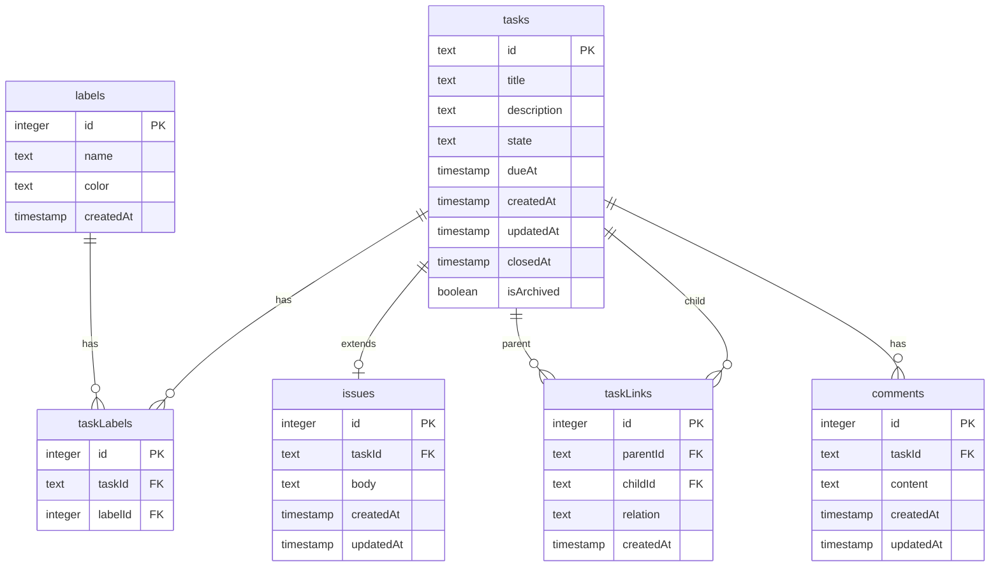

## テーブル

- `tasks`: タスク
  - `id`: タスクの一意識別子
  - `title`: タスクのタイトル
  - `description`: タスクの詳細説明
  - `state`: タスクの状態（未着手、進行中、完了など）
  - `dueAt`: タスクの締め切り日時
  - `createdAt`: タスク作成日時
  - `updatedAt`: タスク更新日時
  - `closedAt`: タスク完了日時
  - `isArchived`: アーカイブフラグ
- `issues`: issue (GitHub issue 的にチケット化したタスク)
  - `id`: issueの一意識別子
  - `taskId`: 関連するタスクのID
  - `body`: issueの内容
  - `createdAt`: issue作成日時
  - `updatedAt`: issue更新日時
- `labels`: タスクに紐付けるラベル
  - `id`: ラベルの一意識別子
  - `name`: ラベル名
  - `color`: ラベルの色
  - `createdAt`: ラベル作成日時
- `taskLabels`: タスクとラベルの中間テーブル
  - `id`: レコードの一意識別子
  - `taskId`: タスクのID
  - `labelId`: ラベルのID
- `taskLinks`: タスクの親子関係を表すテーブル
  - `id`: レコードの一意識別子
  - `parentId`: 親タスクのID
  - `childId`: 子タスクのID
  - `relation`: 関係の種類（ブロック、依存など）
  - `createdAt`: 関係作成日時
- `comments`: タスクに対するコメント
  - `id`: コメントの一意識別子
  - `taskId`: 関連するタスクのID
  - `content`: コメント内容
  - `createdAt`: コメント作成日時
  - `updatedAt`: コメント更新日時
