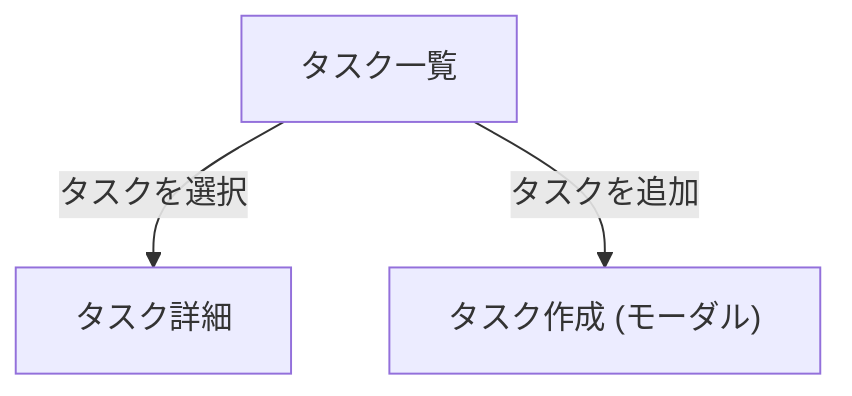

## 機能

- タスク一覧
  - [ ] 一覧
  - [ ] タスク検索
- [ ] タスク詳細
  - [ ] ラベル
  - [ ] 親子関係
  - [ ] 時系列でコメント (メモ)
- [ ] (optional) スケジュール管理
    - Todoist などと連携すれば良いので単体では must ではない

### 特徴

- 個人専用
- モバイルでも入力しやすい
- UX がネイティブアプリっぽい

## サイトマップ

```
/                        # トップページ / タスク一覧等 inbox
├── tasks/               # 404
│   ├── [taskId]         # タスク詳細
│   └── labels/          # ラベル一覧
└── settings/            # ? (WIP)
```

## ユーザーフロー

