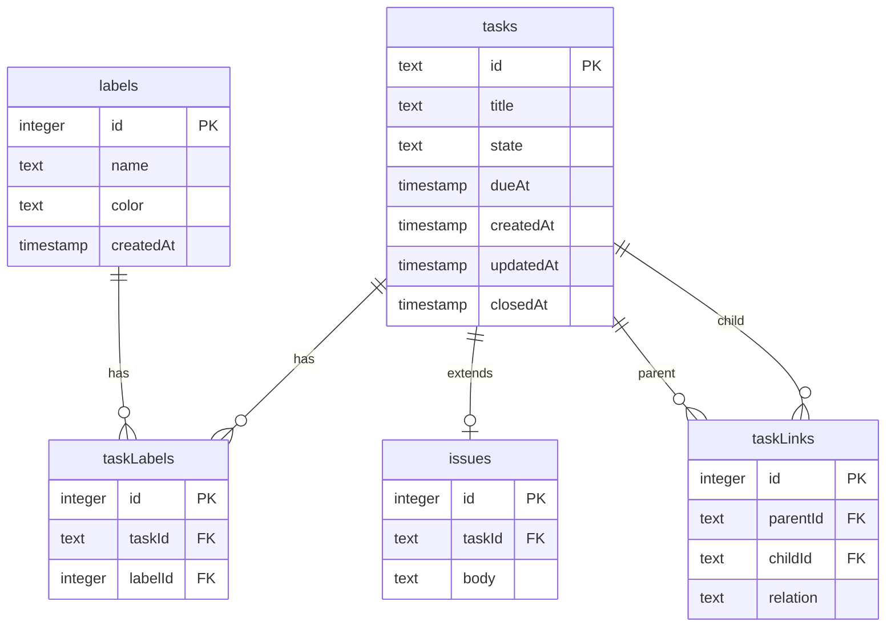

## 機能

- タスク一覧
  - [ ] 一覧
  - [ ] タスク検索
- [ ] タスク詳細
  - [ ] ラベル
  - [ ] 親子関係
  - [ ] 時系列でコメント (メモ)
- [ ] (optional) スケジュール管理
    - Todoist などと連携すれば良いので単体では must ではない

### 特徴

- 個人専用
- モバイルでも入力しやすい
- UX がネイティブアプリっぽい

## サイトマップ

```
/                          # inbox
├── tasks/                 # タスク一覧
│   └── [taskId]           # タスク詳細 (モーダル)
├── issues/                # issue 一覧
│   └── [issueId]          # issue 詳細
├── labels/                # グローバルなラベル一覧・管理
│   └── [labelId]          # 特定ラベルが付いたタスク一覧 (グローバル)
└── settings/              # 設定ページ
```

## テーブル



- `tasks`: タスク
- `issues`: issue (GitHub issue 的にチケット化したタスク)
- `labels`: issue に紐付けるラベル
- `taskLabels`: タスクとラベルの中間テーブル
- `taskLinks`: タスクの親子関係を表すテーブル